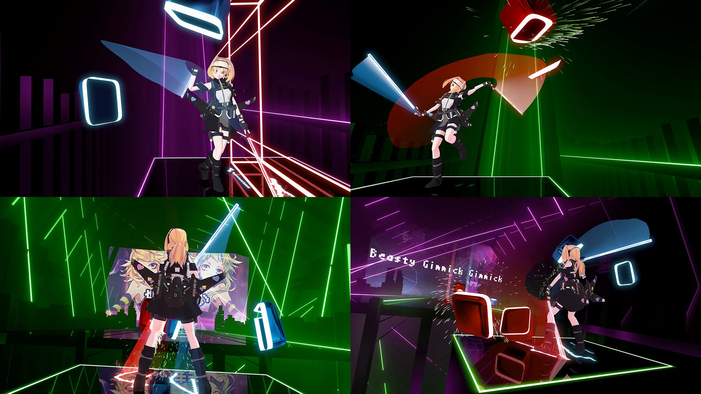

# Blender2Camera2

## What is this?

Blender2Camera2 is a tool for creating custom [Camera2](https://github.com/kinsi55/CS_BeatSaber_Camera2) movement scripts in Blender.

For documentation and an extensive tutorial, please visit the main [Blender2Camera2 docs site](https://kandywrong.com/b2c2/).

Check out the [Releases](https://github.com/KandyWrong/blender2camera2/releases) to get the latest download package.

This project is not affiliated with kinsi55's Camera2 project. Please do not contact them for support with Blender2Camera2.

## What can I do with it?

The python script and the Blender templates give you a way to use Blender to create fully customized movement scripts for the Beat Saber Camera2 plugin.

If you're in a hurry then have a look at some screenshots from my LUVORATORRRRRY! Beat Saber video below, or [watch the whole thing on YouTube](https://youtu.be/ISJmNQHka8I).

## What's in here?

* The Blender2Camera2 export python script, for use with Blender
* A Blender template file (so you don't have to create your own)
* Several Blender file and Camera2 movement script examples, including the file / script I used to create my [LUVORATORRRRRY! Beat Saber video](https://youtu.be/ISJmNQHka8I)

## How do I use it?

Everything you need to know is at the [Blender2Camera2 docs site](https://kandywrong.com/b2c2/).
