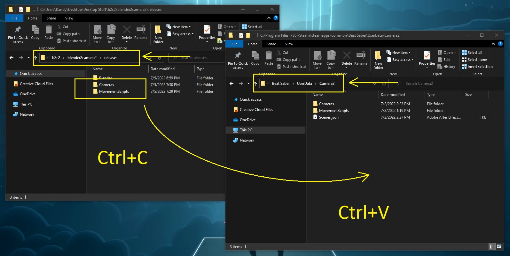
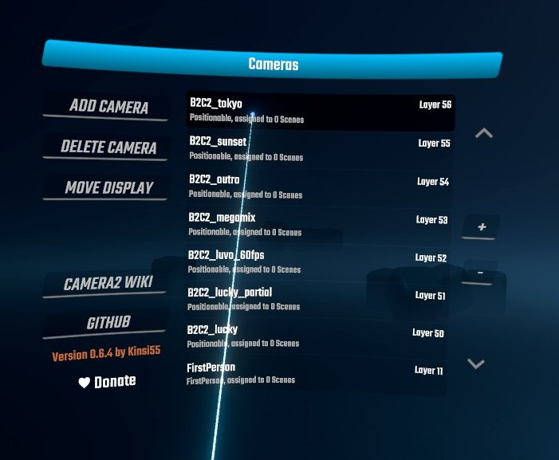
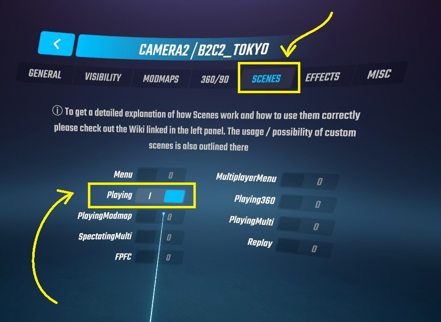

## Installing Movement Scripts

This folder contains a pack of movement scripts and associated camera configurations. You don't have to mess around with editing cameras. Just copy, paste, and play.

1. In the `blender2camera2\releases` folder, select `Cameras` and `Movementscripts`. __Copy__ (Ctrl + C) these folders.
2. In your `Steam\steamapps\common\Beat Saber\UserData\Camera2` folder, __Paste__ (Ctrl + V) these folders.

If Windows prompts you to overwrite anything, verify that the files don't already exist (they probably don't), and then click __Yes__ to transfer the files.

The new cameras (and the movement scripts) will be available under the Camera2 plugin menu within Beat Saber.

Don't forget to activate the movement script you want to use.

Notes for each track are shown below.

## B2C2_lucky.json

* This script is not designed for use with any particular track. It works best for rock music with high BPM.
* This script runs at 60FPS.

## B2C2_luvo_60fps.json

* Designed for use with *Reol - LUVORATORRRRRY!* (bsaber 4cfb), or any pop / dance track with high BPM.
* This script runs at 60FPS.
* If you aren't sure which *LUVORATORRRRRY!* script to use, use this one.

## B2C2_sunset.json

* Designed for use with *Sunset Neon - Tonight* (bsaber 3d13), or any track with mid BPM.
* This script runs at 60FPS.
* This script works best for collabs, but will still work just fine when running solo.

## B2C2_tokyo.json

* Designed for use with *Tokyo Machine - PLAY (nitronik.exe remix)* (bsaber 17e36), or any electronic / dance track with high BPM.
* This script runs at 60FPS.

## (Bonus Script) B2C2_megamix.json

* This script is ~10 minutes long. It is a combination of all four scripts listed above.
* This script runs at 60FPS.

This release includes 2 additional movement scripts that technically *work*, but might not work the way you want:

## B2C2_lucky_partial.json

* Designed for use with *Celldweller - The Lucky One* (bsaber 11bfd)
* This script runs at 60FPS.
* This camera path is incomplete. It runs from 2:13 to 3:40.
* The camera is static outside this time range.

## B2C2_luvo_120fps.json

* Designed for use with *Reol - LUVORATORRRRRY!* (bsaber 4cfb)
* This script runs at 120FPS. If you are concatenating scripts, use reol_luvo_60fps.json.
* This script was exported with B2C2 v1.0, which was buggy. You will not get the same results with B2C2 v1.1 and newer.
* You may notice strange stuttering when running this script at a frame rate other than some multiple of 60FPS (90, 144, etc).
